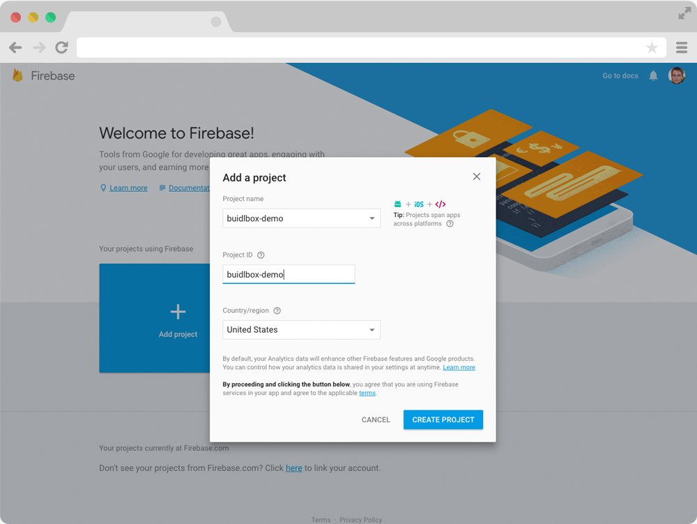
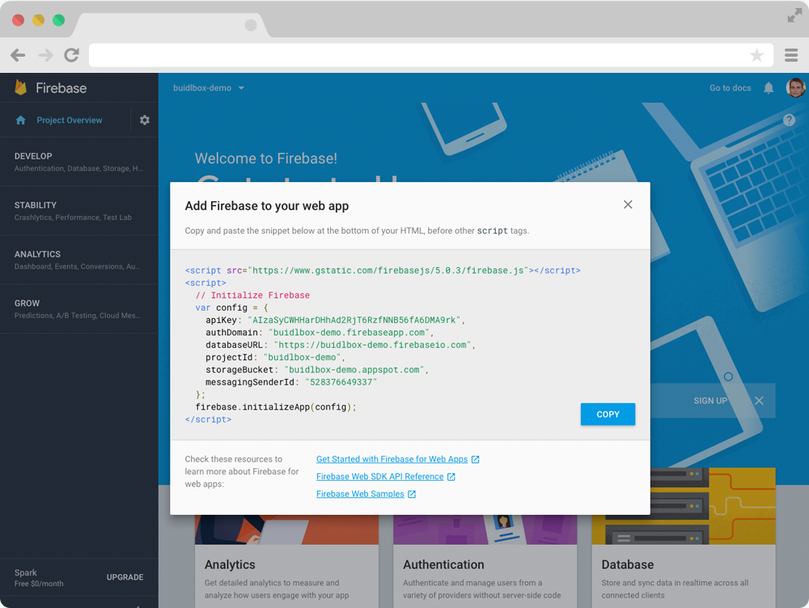
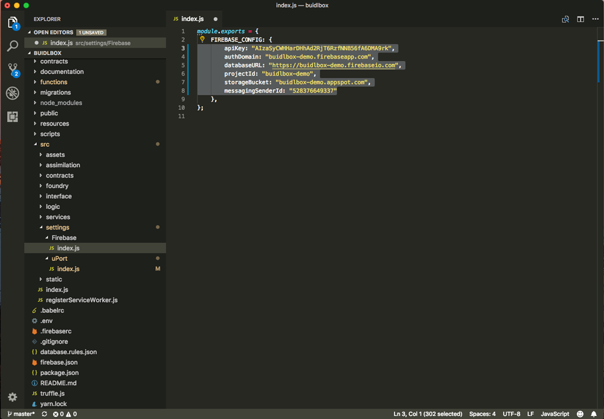

# BuidlBox - Beta

The BuidlBox is a boilerplate for rapidly prototyping creating Web 2.0 and Web 3.0 applications.


The boilerplate includes includes ready-to-go components, integrations with popular decentralized solutions (uPort, IPFS, ethers.js, Web3, ShapeShift, 0x) and integrations wi

## Overview
Core building block include decentralized login using uPort, smart contract compilling/deployment/testing with Truffle and communication with the blockchain via Infura. 

The BuidlBox boilerplate also provides core building blocks like Redux, Routing, State Management, Atomic Components and Firebase.

TL;DR: Rapid protoping of decentralized applications using mesh solutions.

## How To Get Involved
It's encouraged to format the BuidlBox issues adhering to our submission guidelines. A primary objective of the BuidlBox is to encourage collaboration and input from the uPort/Ethereum growing community. We want this to be your project. If you see an opportunity. Great! Create a public issue, uPort will fund the bounty and together we'll Open Source The World.

- User Story
- Background
- Acceptance Criteria
- Technical Details


### Install

```
$ npm install -g truffle

-------- Step 1 --------
git clone git@github.com:uport-project/buidlbox.git ; cd buidlbox

-------- Step 2 --------
npm install || yarn

------- Step 2.5 (Optional) -------
npm install -g truffle // Smart Contract Management

------- Step 3 (Optional) -------
npm run build || yarn build => development
npm run start || yarn start => production
```

### Web 2.0 and Web 3.0 Capabilities
The BuidlBox is built to utilize both Web 2.0 and Web 3.0 capabilities. For the time being, decentralized solutions haven't reached full maturity, which means we still have to rely on traditional methods of building applications. However, moving forward the BuidlBox will start to migrate as many features as possible to the decentralized web i.e. file storage on IPFS, membership payments using ChronoLogic, distributed computing using WebAssembly, and more.


#### Firebase - The Web 2.0 Platform
The BuidlBox includes a Firebase backend to simplify deployment of Web 2.0 and Web 3.0 application requiring authentication, hosting, database (JSON and NoSQl), and serverless infrastructure (Cloud Functions). You might be asking "Why pick Google servers to build decentralized applications?", which is a great question! And the answer is "Convenience." For the time being it's more important developers can easily experiment with emerging solutions using production ready platforms. Once we're ready to make the switch from centralized services to decentralized services, the BuidlBox will change it's architecture to match those requirements.
 
### Create A New Project
1. Register a Web 3.0 decentralized application on uPort
2. Create a new Web 2.0 project on Firebase.

uPort Application Manager
http://appmanager.uport.me

The AppManager provides an easy-to-use interface for developers to quickly register decentralized applications on the Ethereum Blockchain.

The AppManager helps developers generate  new keypairs, upload application information to IPFS and register the application on the Ethereum blockchain in just a few simple steps. Scan a QR code. Sign a transaction request. Done.

- Login to AppManager
- Create New Application
- Edit Application Details
- Save Decentralized Application
- Add SimpleSigner Private Key to Backend Services

The uPort AppManager makes registering a new decentralized application on the blockchain quick and easy. uPort helps hide away the complexities of interacting with decentralized solutions like Ethereum and IPFS, so developers can focus on application features and not blockchain scaling solutions.

Firebase Project
https://firebase.google.com


#### Create A New Project
The Firebase platform makes it easy to launch new Web 2.0 applications. Simply create a new project and the neccesary infrastructure will be initialized.



#### Copy/Paste Project Configuration



#### Connect Firebase and BuidlBox Frontend 
After a new Firebase project has been initialized it's time to copy/paste the project configuration files into the BuidlBox settings.

The default BuidlBox settings are located in `/src/settings/Firebase/index.js` which should be replaced with the newly minted configuration parameters


The Firebase Authentication server by default communicates with `localhost` and default project url e.x. `buidlbox-demo.firebaseapp.com` but when it's time to run the project in a production environment the default settings should be changed to reflect specific project requirements.

### Custom Authentication Server
uPort allows users (self-sovereign identities) to authenticate themselves with Web 2.0 applications using the Ethereum Blockchain. However,to take advantage of these capabilities a custom authentication server is required. Fortunately, the BuidlBox contains an `identity` Cloud Function, which includes Firebase and uPort Authentication services, so developers can quickly setup an authentication service, so uPort Identities can login to a web application.

The `identity` Cloud Function is located in `functions/src/index.js` and is being exported via `exports.identity` object. When the Firebase Cloud Functions are deployed an HTTPS endpoint is created, which is accessed using the `UPortLoginFirebase` component located in `src/assimilation/containers/uport` folder.

#### Authentication Server Snippet
To properly authenticate a decentralized, self-sovereign identity requires authentication using the `uportCredentials.receive()` function, which is passed the `JWT` or otherwise referred to as the `access_token` when returned from the uPort Mobile Application.

```
exports.identity = functions.https.onRequest((request,response)=> {
  cors(request, response, () => {
    const JWT = request.body.JWT
    uportCredentials.receive(JWT)
    .then(profile => {
      if (profile.name) {
        admin.auth().updateUser(profile.address, {
          displayName: profile.name
        })
      }
    ...
```

Warning: The current setup is meant to provide a simple demonstration. The current iteration could be improved to include more security best practices. For example additional defaults `rules` need to be set in the realtime database, to limit data exposure 


### Set Environment Variables
Each project requires setting envrionment variables i.e. AppName, Address and Private Key to privately issues attestations.

As a developer starting to experiment with decentralized solutions, like the Ethereum Blockchain, you're probably already familiar with cryptography and the use public/private key-pairs in server environments, whether that's validating yourself with a backend server using `ssh` or authenticating to `git` server to push new code.

```
firebase functions:config:set uport.appname=APPNAME uport.simplesigner=SIMPLESIGNER uport.address=ADDRESS
```

To limit exposure of the private keys (hardcoding) BuidlBox uses environment variables to minimize the exposure of sensitive information. Additionally, environment variables are used to minimize code changes when neccesary, like for example setting the application name, which doesn't require the same dudiligence as private key management, but is simply more convient.

The environment variables are passed to the Firebase Cloud Functions during runtime and function invocation (either directly via a HTTPS post request or by monitoring database paths.

Below the `firebase-functions` config method is called, creating a `configuration` object, which contains the required environment variables. The uPort `configuration` parameters are passed to the uPort `Credentials` class function, which creates an object capable of requesting login credentials and generating private attestations.

```
const functions = require('firebase-functions')
const configuration = functions.config()

// uPort
const uportAppName = configuration.uport.appname
const uportAppAddress = configuration.uport.address
const uportSimpleSignerKey = configuration.uport.simplesigner

const uportCredentials = new Credentials({
  appName: uportAppName,
  address: uportAppAddress,
  signer: uportSimpleSigner,
})
```


*Warning:* The SimpleSigner is the private key responsible for signing "attestation" requests. If you're planning on running a production application particpating in the *Web of Trust* please be very **careful** about the procedures for managing the private key. For the time being BuidlBox is under active development and should be considered beta - we recommend developers experiment with building applications that contributed to the Web of Trust. In other words, better private key management is still required before attestations can be issued with a high degree of confidence the "trust" won't be broken by a malicious actor compromising the private key.

#### Authentication 
A primary feature of uPort's Decentralized Identity is authentication using the Ethereum Blockchain.
